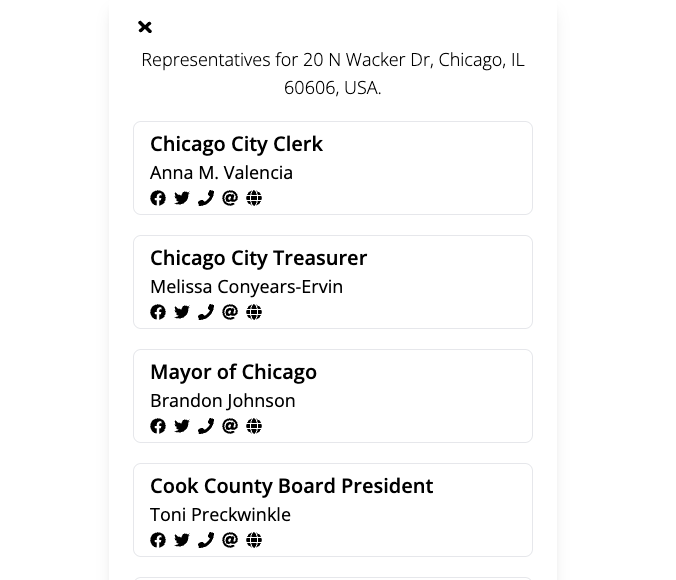
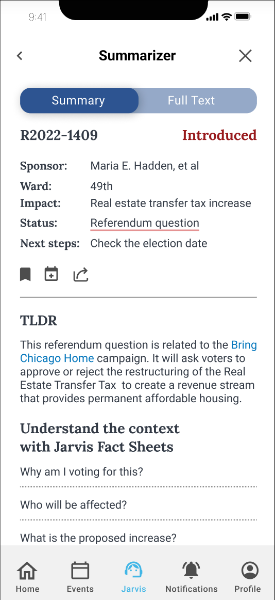
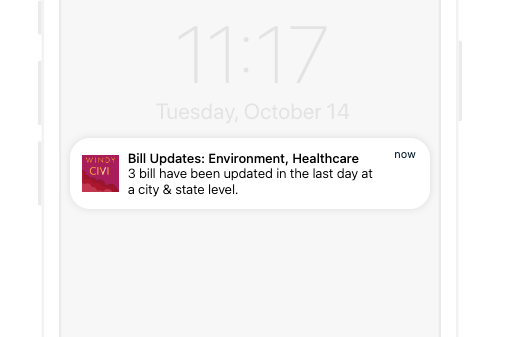
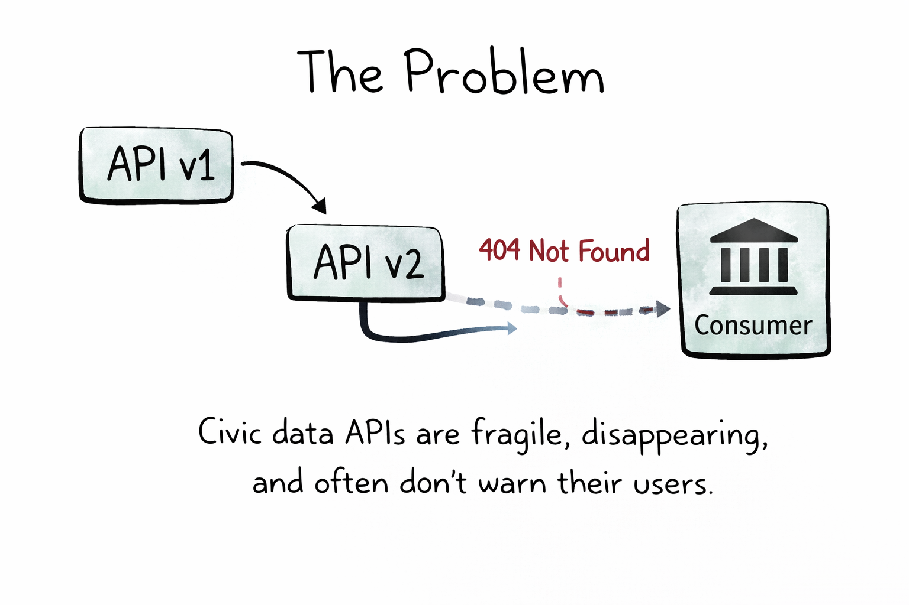
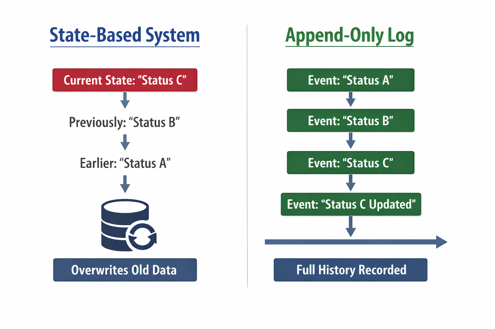
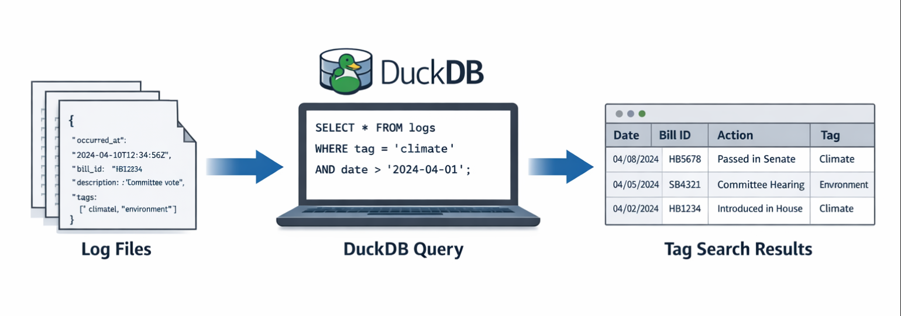
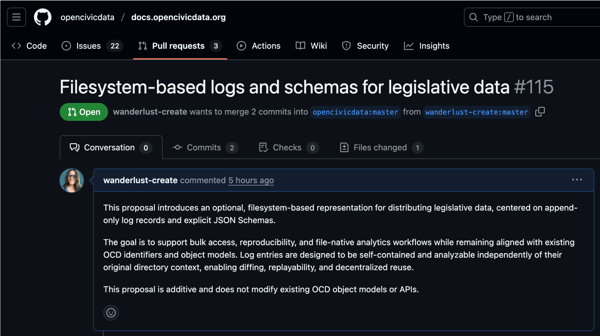
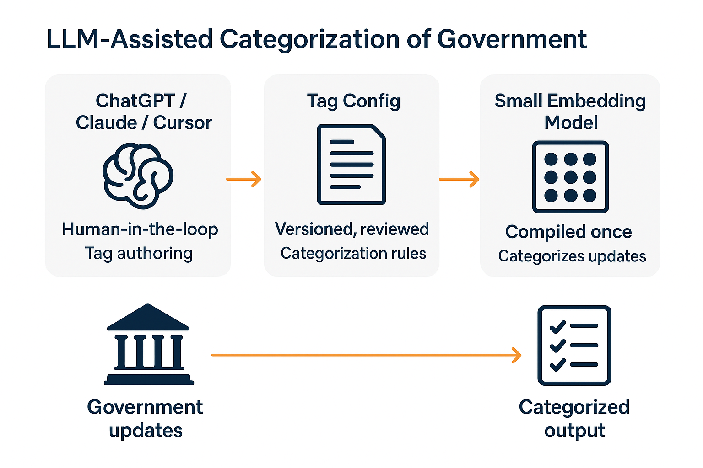

<style>
@import url('https://fonts.googleapis.com/css2?family=Courier+Prime:wght@400;700&display=swap');

:root {
  --govbot-blue: #38b6ff;
  --govbot-red: #ff3131;
  --dark-bg: #0a1628;
  --light-bg: #ffffff;
  --text-dark: #0a1628;
  --text-light: #f5f5f5;
  --accent-blue: #38b6ff;
  --accent-red: #ff3131;
}

@font-face {
  font-family: 'Lucida Condensed';
  src: local('Lucida Grande'), local('Lucida Sans Unicode'), local('Lucida Sans'), sans-serif;
}

/* Base Theme */
section {
  font-family: 'Lucida Condensed', 'Lucida Grande', sans-serif;
  background: linear-gradient(135deg, var(--dark-bg) 0%, #1a2a3a 100%);
  color: var(--text-light);
  font-size: 28px;
  line-height: 1.5;
}

/* Title Slide */
section.lead {
  display: flex;
  flex-direction: column;
  justify-content: center;
  align-items: center;
  background: linear-gradient(135deg, var(--govbot-blue) 0%, var(--govbot-red) 100%);
  color: white;
}

section.lead h1 {
  font-size: 72px;
  font-weight: bold;
  margin: 0;
  text-shadow: 2px 2px 4px rgba(0, 0, 0, 0.3);
}

section.lead p {
  font-size: 32px;
  margin-top: 20px;
  opacity: 0.95;
}

/* Headings */
h1 {
  color: var(--govbot-blue);
  font-size: 56px;
  font-weight: bold;
  margin: 0 0 30px 0;
  border-bottom: 3px solid var(--govbot-red);
  padding-bottom: 15px;
  letter-spacing: -1px;
}

h2 {
  color: var(--govbot-blue);
  font-size: 48px;
  font-weight: bold;
  margin: 0 0 25px 0;
  letter-spacing: -0.5px;
}

h3 {
  color: var(--accent-red);
  font-size: 36px;
  font-weight: bold;
  margin: 15px 0;
}

h4, h5, h6 {
  color: var(--govbot-blue);
  font-weight: bold;
}

/* Lists */
ul, ol {
  margin: 20px 0;
  padding-left: 40px;
}

li {
  margin: 10px 0;
  line-height: 1.6;
}

li strong {
  color: var(--govbot-red);
}

/* Links */
a {
  color: var(--govbot-blue);
  text-decoration: underline;
}

a:hover {
  color: var(--govbot-red);
}

/* Code Blocks */
code {
  background: rgba(56, 182, 255, 0.1);
  color: var(--govbot-blue);
  padding: 2px 8px;
  border-radius: 4px;
  font-family: 'Courier Prime', monospace;
  font-weight: 500;
}

pre {
  background: rgba(10, 22, 40, 0.8);
  border-left: 4px solid var(--govbot-red);
  padding: 16px;
  border-radius: 4px;
  font-size: 18px;
  line-height: 1.4;
  overflow-x: auto;
}

pre code {
  background: none;
  color: var(--govbot-blue);
  padding: 0;
}

/* Blockquotes */
blockquote {
  border-left: 4px solid var(--govbot-red);
  padding-left: 20px;
  margin-left: 0;
  color: var(--accent-red);
  font-style: italic;
  font-size: 28px;
}

/* Special Slide Classes */
section.intro {
  display: flex;
  justify-content: center;
  align-items: center;
  background: linear-gradient(135deg, var(--govbot-blue) 0%, #1a5f99 100%);
}

section.outro {
  display: flex;
  justify-content: center;
  align-items: center;
  background: linear-gradient(135deg, var(--govbot-red) 0%, #b00000 100%);
  color: white;
}

section.outro h1 {
  border: none;
  color: white;
  font-size: 64px;
}

/* Images */
img {
  max-width: 90%;
  max-height: 80%;
}

/* Emphasis */
strong {
  color: var(--govbot-red);
  font-weight: bold;
}

em {
  color: var(--govbot-blue);
  font-style: italic;
}

/* Tables */
table {
  border-collapse: collapse;
  width: 100%;
  margin: 20px 0;
}

table th {
  background: var(--govbot-blue);
  color: white;
  padding: 12px;
  text-align: left;
  font-weight: bold;
}

table td {
  border-bottom: 1px solid var(--govbot-blue);
  padding: 12px;
}

table tr:hover {
  background: rgba(56, 182, 255, 0.1);
}

/* Pagination */
section::after {
  font-family: 'Lucida Condensed', sans-serif;
  font-size: 18px;
}
</style>

<!-- _class: TITLE -->


# **Govbot**

Federated, open-source legislative data for everyone

---

# **Overview**

The Problem
Our Solultion
What We Offer
Features
Setup + Core Functions

---

## The Problem

> Why don't we pay attention to our representatives between elections?

Legislative data is hard to parse, track, and organize. Activists, concerned citizens, and the curious may not have the time, resources, or expertise to build out duplicative tech stacks.

---

## The Problem (cont.)

Existing solutions may be limited by the willingness of organizations and companies to continue to run and host them - such as in the case of Google's Civic Information API, which was shut down earlier this year.

**What would a decentralized, open-source legislative data solution look like?**

---

## Our Solution

The Govbot team's goal is to bridge this gap - building the framework for federated, open-source, non-profit legislative data.

Built as a [Chi Hack Night](https://chihacknight.org) [Breakout Group](https://github.com/chihacknight/breakout-groups/issues/219), this project offers frameworks and tools built on top of OpenStates' data on state and federal legislation.

---

## What We Offer

The main Govbot dataset currently includes legislative updates from:

- the U.S. House & Senate
- Legislatures from all 50 states
- Legislatures from U.S. territories

Data is organized as .json files using the Project Open Data catalog format, scraped and appended regularly.

---

## Features

- A decentralized, regularly updating, legislative data catalog
- AI-powered, topic-based tagging and summaries, customized using .yml
- SQL querying via DuckDB interface
- Example applications, like custom websites (see our demo [WindyCivi](https://windycivi.com/) site), and social media bots (see our [BlueSky bot](https://bsky.app/profile/test-hoan-huynh.bsky.social), made in collaboration with U.S. Representative Hoan Huynh)

---

## Setup

You can download the setup script via one-line install, from our GitHub repository:

```
sh -c “$(curl -fsSL https://raw.githubusercontent.com/windy-civi/toolkit/main/actions/govbot/scripts/install-nightly.sh)
```

## Core Functions

Once installed, you can:

- Clone the entire dataset
- Clone specific items (state, session, or bill)
- Load metadata into a SQL-accessible DuckDB database

---

<!-- _class: section-header -->

# **Project History**

---

## 2022: socratic.center

<div style="display: flex; gap: 2rem; align-items: center; height: 100%;">
  <div style="flex: 1;">
    The Govbot project began in 2022 at socratic.center with a vision to create a destination for simplified, summarized updates on legislative action.

    The initial hypothesis: *What if citizens could easily track and understand the bills being voted on?*

  </div>
  <div style="flex: 1; display: flex; justify-content: center; align-items: center;">
    
  </div>
</div>

---

## civi.social

<div style="display: flex; gap: 2rem; align-items: center; height: 100%;">
  <div style="flex: 1;">
    We built civi.social, exploring how to make legislative information accessible and shareable on social platforms.

    This experiment helped us understand how citizens wanted to engage with civic data in their existing communities.

  </div>
  <div style="flex: 1; display: flex; justify-content: center; align-items: center;">
    
  </div>
</div>

---

## myChicago + Jarvis

<div style="display: flex; gap: 2rem; align-items: center; height: 100%;">
  <div style="flex: 1;">
    We created a prototype for what integration with the myChicago platform would look like.

    The goal of Jarvis, our AI-powered assistant, would have been to help users understand legislation through:
    - Simplified bill summaries
    - Contextual information
    - Guided engagement tools

  </div>
  <div style="flex: 1; display: flex; justify-content: center; align-items: center;">
    
  </div>
</div>

---

## Windy Civi: Full Launch

<div style="display: flex; gap: 2rem; align-items: center; height: 100%;">
  <div style="flex: 1;">
    After reflecting on previous concepts, the Windy Civi app and website launched in beta in 2024.

    The goal was to enable citizens to:
    - Track bills by topic
    - Receive personalized updates
    - Connect directly with representatives

  </div>
  <div style="flex: 1; display: flex; justify-content: center; align-items: center;">
    
  </div>
</div>

---

## Rethinking Our Approach

While building these solutions, we began to ask a critical question:

**What are the limitations of a centrally-managed platform?**

- Can it scale to serve all communities?
- What happens if we stop maintaining it?
- How can others build on this work?

---

## Our New Vision

Our vision has now pivoted to building **the infrastructure itself**:

1. **A decentralized legislative data data catalog**
2. **Reusable frameworks** for communities to build their own tools
3. **Sample applications** demonstrating use cases

**Our goal:** Ensure that government accountability is accessible to all.

---

# **Live Demos**

Basic Setup + Commands
Querying via DuckDB
Creating Social Media Bots

---

## Basic Setup + Commands

Install via:

```
sh -c “$(curl -fsSL https://raw.githubusercontent.com/windy-civi/toolkit/main/actions/govbot/scripts/install-nightly.sh)
```

Once installed, you can download and set up the data using the following commands

```
govbot # to see help
govbot clone # to show available datasets
govbot clone {{locale}} {{locale}} # download specific items
govbot delete {{locale}} # delete specific items
govbot delete all # delete everything
govbot load # load bill metadata into DuckDB
```

---

## Querying with DuckDB

First, set up DuckDB, which creates a simulated database from the .json log files:

```
govbot load #Load all data into a database
govbot load –database my-bills.duckdb #Specify a custom database file
govbot load –memory-limit 32GB –threads 8 #With memory limit and thread settings

duckdb –ui govbot.duckdb #Open in DuckDB UI (opens in browser)
```

Once the DuckDB database is created, you can query as normal

```
– Load JSON extension
INSTALL json;
LOAD json;
– Query all bill metadata
SELECT *
FROM read_json_auto(’~/.govbot/repos/**/bills/*/metadata.json’)
LIMIT 10;
```

---

## Creating Social Media Bots

---

# **Technical Details**

---

## Our Open Civic Data Proposal

---

## Democratizing government data

- What does it mean to democratize government data?
- Today: legislation (with room to expand to courts, agencies, and more)
- To understand the solution, it helps to first understand the problem

---

## The problem

Legislative data is commonly distributed through APIs or large database dumps. These approaches work well for transactional access, but they introduce real limitations when the goal is long-term analysis and accountability.

They make it harder to:

- Perform bulk or historical analysis
- Track changes over time
- Analyze data without running a database server

They also introduce fragility:

- APIs change or disappear
- Long-term access and verification become difficult

---



---

## Why this matters

- Civic trust
- Research
- Accountability
- Anyone can verify, not just institutions
- A shared source of truth without interpretation baked in

---



---

## What we built (and why Git)

- File-based structure
- Bills, events, logs
- Deterministic paths to find things
- Built on Git for history, distribution, cheap branching, and broad accessibility
- Aligned with Open States data and Open Civic Data (OCD) identifiers
- Formalized through an Open Civic Data proposal

This design treats the filesystem as the primary interface for civic data.

---

## 

---

## The OCD proposal (why this matters upstream)

- Makes the model reusable beyond Windy Civi
- Provides shared vocabulary and structure
- Enables other projects to adopt or adapt the approach

---

## 

---

## Technical challenges and triumphs

- Making transformations deterministic so Git diffs remain meaningful
- Interpreting and triaging state-by-state scraper errors
- Passing data cleanly between CI steps (artifacts, environment variables, Docker parity)
- Designing self-contained log entries that remain analyzable outside their folder context
- Building a “last seen” mechanism when upstream sources return full snapshots
- Identifying hard limits: PDF redlines and crossouts remain an open problem

---

## A Dive Into Local AI Tagging

---

**Use two models for two very different roles**

- **Smart LLM (ChatGPT / Claude / Cursor)**
  - Human-in-the-loop
  - Used during development
  - Produces tag configuration
- **Small embedding model**
  - Fully automated
  - Used in production
  - Categorizes every update

> The smart LLM helps _write_ the rules
> The small model _runs_ them

---

## Step 1: Tag Authoring (Developer Workflow)

A developer sits down with:

- Sample legislative updates
- Court rulings
- Regulatory notices

Using ChatGPT / Claude / Cursor, they prompt:

> "Create a tag config for legislative bill introductions.
> Include examples, negative examples, and keywords."

The output is **reviewed, edited, and committed** like code.

---

## Important Clarification

**The "smart" LLM is not part of production.**

It is used the same way you'd use:

- A code editor
- A linter
- A schema generator

Think of ChatGPT / Claude / Cursor as a **tag authoring tool**.

---

## What the Smart LLM Actually Does

The smart LLM is used **interactively by a developer** to:

- Define new tags
- Refine descriptions
- Generate examples and edge cases
- Identify negative examples
- Propose include / exclude keywords

It replaces manual taxonomy writing — not runtime logic.

---



---

## What’s next for the project

- Building relationships with activists and journalists
- Creating + designing customizable tagging templates + a system to share them
- Incorporating Executive Orders, judicial opinions, and other relevant non-legislative documents
- Exploring use cases for the data, such as automated content pipelines
- Add donation data for analysis of legislative priorities and campaign promises

---

# Special thanks to the following contributors:

Sartaj Chowdhury
Tamara Dowis
Edwin Chalas Cuevas
Andrew Dauphinais
Emme
Kari Douglass
Marissa Heffler
Sartaj Chowdhury
Zach Schoneman
Brian Burns

---

# Thank You!

- Chi Hack Night
- Open States
- Open Civic Data community

Building government accountability tools accessible to all

<!-- _class: title -->


---

# **Appendix**

Contributing & Testing
FAQs

---

## Contributing & Testing

### Prerequisites

Knowledge of Rust and the `just` task runner required.

1. **Rust & Cargo**: Install the [Rust Toolchain](https://rustup.rs/)
2. **Just**: Install the task runner: `cargo install just`

---

## Development Workflow

Use `just govbot ...` as your CLI "dev" environment.

**Useful Commands:**

- `just` - See all available tasks
- `just test` - Run all tests
- `just review` - Review snapshot test changes
- `just mocks [LOCALES...]` - Update mock data for testing

---

## Dataset Status Key

- 🆕 The locale's data received updates since your last cloning
- ✅ Your data is up-to-date with the most current version
- 🔄 The data is currently being updated
- ❌ The data is not currently accessible

---

## FAQs: Repositories

**Can I See The Repo?**

- Main repo: [windy-civi/windy-civi](https://github.com/windy-civi/windy-civi)
- Toolkit repo: [windy-civi/toolkit](https://github.com/windy-civi/toolkit)

---

## FAQs: Data Structure

**How Is The Data Structured?**

Find the file format structure and .json schema in the readme.md:
[DATA_STRUCTURES.md](https://github.com/windy-civi/toolkit/blob/main/actions/format/docs/DATA_STRUCTURES.md)

---

## FAQs: Cloning Data

**How Do I Clone This Data?**

Each locale is scraped using a GitHub Actions template explained here:
[README_TEMPLATE.md](https://github.com/windy-civi/toolkit/blob/main/actions/format/docs/for-caller-repos/README_TEMPLATE.md)

To manage multiple pipelines or locales, see our [pipeline manager documentation](https://github.com/windy-civi/toolkit/tree/main/actions/pipeline-manager)

---

## Stay Connected

**How Can I Stay Updated, Or Get In Touch?**

- Follow our work at [Chi Hack Night](https://chihacknight.org)
- Check commits and updates on [GitHub](https://github.com/windy-civi)
- Visit our [Docs page](https://docs.windycivi.com)
- Join the [Chi Hack Night Slack](https://chihacknight.slack.com/archives/C047500M5RS)
